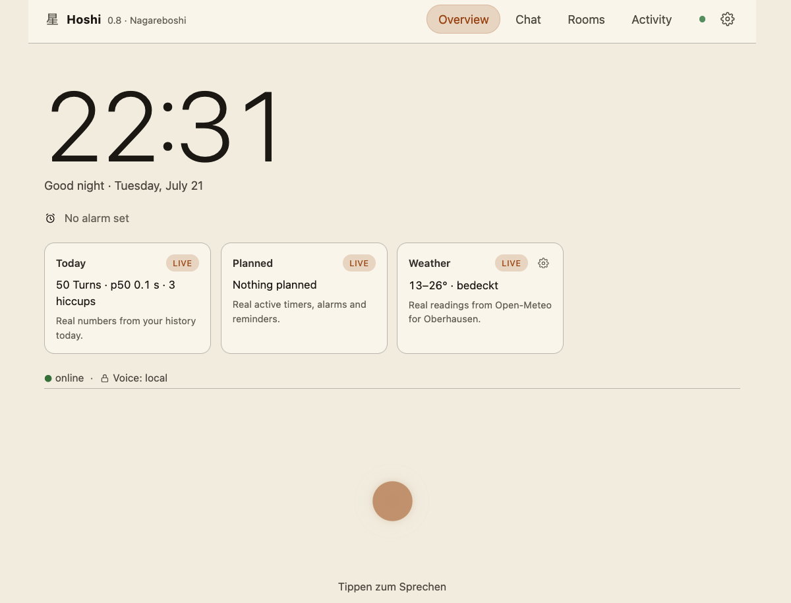
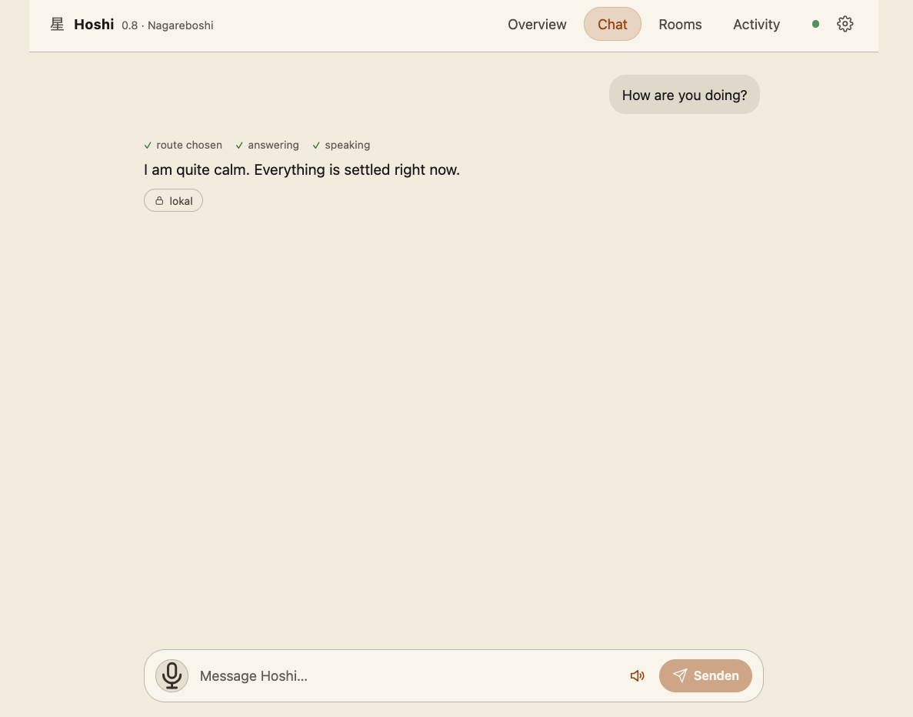

# Hoshi 星

**[English](#hoshi--english)** · **[Deutsch](#hoshi--deutsch)**

<picture>
  <source media="(prefers-color-scheme: dark)" srcset="docs/assets/hero-dark.svg">
  
</picture>

<p align="center">
  
  
</p>

<p align="center">
  <sub>
    Übersicht und Chat, hier auf Englisch — die Oberfläche folgt der gewählten Sprache (DE/EN/ES/FR/IT).<br>
    Die Häkchen über jeder Antwort zeigen, was der Turn <em>wirklich</em> getan hat; das Schloss, ob er lokal blieb.
  </sub>
</p>

---

## Hoshi — Deutsch

> Ein privater, deutscher, **lokal-first** Voice-Assistent, dem man vertrauen kann.
> Läuft auf einem einzelnen Apple-Silicon-Mac (16 GB). Keine Cloud-Pflicht, keine projektseitige Telemetrie,
> deine Stimme bleibt bei dir.

**Status:** 0.8 „Nagareboshi" — aktiv in Entwicklung, Richtung 1.0.

### Was Hoshi kann

- **Lokaler Voice-Turn verfügbar.** Wake-Word on-device (ESP32-S3) → Whisper-STT →
  Gemma-4-Brain (MLX, Metal-GPU) → TTS mit satzweisem Streaming — warm ab ~3 s bis zum ersten Ton.
- **Sprechererkennung mit Sicherheits-Gate.** Geführtes 3-Satz-Enroll und lokale CAM++-Embeddings
  sind gebaut; nach einer reproduzierten Fehlbindung ist die Erkennung derzeit bewusst abgeschaltet.
  Unbekannte Stimmen werden nie automatisch enrollt. Ein separat aktivierbarer Diagnose-Mitschnitt
  kann während einer Testphase rohes Audio lokal speichern und wird deshalb ausdrücklich als
  Privacy-Ausnahme dokumentiert.
- **Eigene Satelliten-Firmware.** HA Voice PE mit eigener ESPHome-Komponente: LED-Ring als
  Sprache (Stimm-VU, Denk-Swirl, Stop-Quittung), Volume-Dial, „Stop"-Wake, Nachtmodus pro Raum
  (Ring dimmt, wenn das Haus schläft).
- **Reflexe ohne Denkpause.** Timer, Wecker und Smart-Home-Kommandos werden über
  deterministische, brain-freie Fastpaths geroutet; externe Geräte-Readbacks bleiben echte
  Netzwerk-Roundtrips.
- **Wetter, ehrlich geerdet.** Ort per Geocoding (keyless open-meteo), Tages-Szenarien,
  Idle-Kachel, Rückfrage bei unklarem Ort.
- **Online-Wissen nur auf Wunsch.** Wenn lokal die Antwort fehlt, kann Hoshi das ehrlich sagen
  und um Erlaubnis zum Nachsehen bitten; ein expliziter Recherche-Befehl ist selbst die Freigabe
  (Quelle wird genannt, Kosten-Cap, Lookup-Default: erst fragen).
- **Ein Tagebuch aus Messwerten, nie aus Inhalten.** Das Nutzungs-Diary speichert Zeitpunkt,
  Kategorie und Latenzen — keine Gesprächsinhalte. Der Aktivität-Tab zeigt p50/p95 je
  Pipeline-Stufe und die Zerlegung jedes Turns.
- **Fünf Farbwelten.** Aoi · Yoru · Asa · Kasumi · Nagareboshi — über gemeinsame Design-Tokens gesteuert,
  `prefers-reduced-motion` wird respektiert.

### Was Hoshi besonders macht

1. **Ehrlichkeit ist Architektur, nicht Stil.** Wenn Hoshi etwas nicht weiß, sagt es das —
   deterministisch, statt zu halluzinieren. Die UI zeigt „—" statt erfundener Zahlen, leere
   Zustände sind ehrlich leer, und der interne Leitsatz `grün ≠ lebt` (ein grüner Test ist noch
   kein lebendes Feature) prägt jede Abnahme.
2. **Vertrauen liegt im Code, nicht im Prompt.** Capability-Kernel mit *default-deny* für jede
   schreibende Aktion; biometrische Stimm-Profile verlassen das Gerät nie; unbekannte Stimmen
   werden nicht automatisch zu Profilen. Der lokale Diagnose-Mitschnitt ist eine explizite,
   temporäre Ausnahme für Roh-Audio — kein stiller Dauerpfad.
3. **Das Modell ist eine tauschbare Zelle.** Hexagonale Ports, Modellwahl per Config-Zeile,
   messbare A/B-Kandidaten und Ohren-Abnahme bei Stimmenwechseln — Hoshi ist gebaut, um mit jeder Modell-Generation
   besser zu werden, ohne seine Seele zu verlieren.
4. **Die 16-GB-Wand als Design-Lehrmeister.** Ein Brain resident, Admission-Steuerung,
   Latenz-Budgets pro Stufe — Genügsamkeit ist hier ein Feature, kein Kompromiss.
5. **Gebaut von einem Menschen mit einem KI-Team.** So ist Hoshi entstanden, und so wird
   es weitergebaut — Mensch und KI als ein Team, das etwas Dauerhaftes baut. (Die
   Projekt-Grundlagen liegen LLM-lesbar im [`vault/`](vault/00-INDEX.md); die private
   Werkstatt dahinter gehört dem Haus.)

### Architektur (kurz)

Hexagonal (Ports & Adapters) — STT-, TTS- und LLM-Engines sind austauschbar; nur DTOs queren
die Grenze. Ein dünnes Backend (Kotlin/Spring WebFlux) orchestriert die ML-Sidecars (Python/MLX)
und spricht über einen authentifizierten `/ws/audio`-Vertrag mit den Satelliten (ESPHome/HA Voice).

### Roadmap (ehrlich)

**0.9:** Wake-Word-Kalibrierung und robustere deutsche Trainingsdaten (der erste lokale
microWakeWord-Pfad läuft bereits experimentell) · Wecker klingeln am
Ursprungs-Satelliten · Setup & Übergabe (`hoshi setup`, SETUP.md, KI-lesbares Onboarding) ·
Multi-Room mit Wake-Arbitrierung · Metriken-Sparklines. **Bekannte Kanten:** siehe
„Ehrlichkeit zuerst" unten.

---

## Hoshi — English

> A private, German-speaking, **local-first** voice assistant you can trust.
> Runs on a single Apple Silicon Mac (16 GB). No cloud requirement, no project telemetry —
> your voice stays home.

<p align="center">
  
  
</p>

<p align="center">
  <sub>
    Overview and chat. The interface follows the chosen language (DE/EN/ES/FR/IT).<br>
    The ticks above each answer show what the turn <em>actually</em> did; the lock shows whether it stayed local.
  </sub>
</p>

**Status:** 0.8 "Nagareboshi" — under active development, heading toward 1.0.

### What Hoshi does

- **A local voice turn is available.** On-device wake word (ESP32-S3) → Whisper STT →
  Gemma 4 brain (MLX on the Metal GPU) → TTS with sentence streaming — first audio from ~3 s.
- **Speaker recognition with a safety gate.** Guided 3-sentence enrollment and local CAM++
  embeddings are implemented; recognition is currently disabled after a reproduced cross-binding.
  Unknown voices are never auto-enrolled. A separately enabled diagnostic capture can store raw
  audio locally during a test window and is documented as an explicit privacy exception.
- **Its own satellite firmware.** HA Voice PE running a custom ESPHome component: an LED ring
  that speaks (voice VU, thinking swirl, stop acknowledgment), a volume dial, a "stop" wake model,
  and a per-room night mode that dims the ring while the house sleeps.
- **Reflexes without thinking pauses.** Timers, alarms and smart-home commands use deterministic,
  brain-free fast paths; external device readbacks remain real network round trips.
- **Weather, honestly grounded.** Location via keyless open-meteo geocoding, day scenarios,
  an idle tile, and a follow-up question when the place is ambiguous.
- **Online knowledge only on request.** When the local brain doesn't know, Hoshi can say so and
  ask permission to look it up; an explicit research command is itself the opt-in (source cited,
  cost cap, quick-lookup default: ask first).
- **A diary of measurements, never of content.** The usage diary stores timestamps, categories
  and latencies — no conversation content. The activity tab shows p50/p95 per pipeline stage and
  a per-turn breakdown.
- **Five color worlds.** Aoi · Yoru · Asa · Kasumi · Nagareboshi — driven by shared design tokens,
  `prefers-reduced-motion` respected.

### What makes it different

1. **Honesty as architecture, not tone.** Unknowns produce a deterministic "I don't know"
   instead of hallucination; the UI shows "—" rather than invented numbers; empty states are
   honestly empty. The house rule `green ≠ alive` (a green test is not yet a living feature)
   governs every acceptance.
2. **Trust lives in code, not in prompts.** A capability kernel with default-deny for every
   writing action; biometric voice profiles never leave the device; unknown voices are never
   auto-enrolled. Local raw-audio capture is a separately enabled, temporary diagnostic exception.
3. **The model is a replaceable cell.** Hexagonal ports, model selection as a config line,
   measurable A/B candidates and human-ear acceptance for voice swaps — built to get better with each model
   generation without losing its soul.
4. **The 16 GB wall as a design teacher.** One resident brain, admission control, per-stage
   latency budgets — frugality is a feature here, not a compromise.
5. **Built by one human with an AI team.** That is how Hoshi came to be, and how it keeps
   being built — human and AI as one team, making something that lasts. (Project foundations
   live LLM-readable in [`vault/`](vault/00-INDEX.md); the private workshop behind them
   belongs to the house.)

### Architecture & build (at a glance)

Hexagonal (ports & adapters); a thin Kotlin/Spring WebFlux backend orchestrates Python/MLX
sidecars and talks to satellites over an authenticated `/ws/audio` contract (ESPHome/HA Voice).

```bash
./gradlew build                          # backend (Kotlin modules + ArchUnit guards)
cd frontend && npm install && npm run build
bin/hoshi run      # boots locally on :8090
bin/hoshi doctor   # honest, read-only stack status (OK/DEGRADED/DOWN)
```

Requires an Apple Silicon Mac (MLX needs the Metal GPU); the Gradle wrapper auto-provisions
JDK 21. Brain, Whisper STT, speaker ID, the knowledge bridge, and the `say`/Piper local-TTS
sidecars live in [`sidecars/`](sidecars/) with pinned bootstrap paths. Large models and the
Wikipedia database remain external artifacts; the legacy Voxtral server still comes from a
separate local checkout and is deliberately disabled. Full German guide: [Build & Run](#build--run).

### For reviewers: verify in 5 minutes

This project's house rule is `green ≠ alive` — central technical claims come with runnable checks, not screenshots
of test output. On any machine with JDK auto-provisioning (see above):

```bash
./gradlew build            # all Kotlin modules + tests + ArchUnit boundary guards
cd frontend && npm install && npm test
python3 tools/speaker-ab/run_ab.py --smoke   # speaker A/B eval harness, self-contained proof
```

Then read, in this order: [`AGENTS.md`](AGENTS.md) (the core executable-truth claims and their commands) ·
[`CHANGELOG.md`](CHANGELOG.md) (dated, honest scope) · [`SECURITY.md`](SECURITY.md)
(default-deny kernel, open findings listed rather than hidden) · [`tools/speaker-ab/`](tools/speaker-ab/)
(offline FAR/FRR evaluation — measurement before any live threshold change). A full voice turn
needs the ML sidecars on Apple Silicon; without them, `bin/hoshi doctor` reports DOWN honestly
instead of faking green — that behavior itself is part of the design.

---

## Stack
- **Backend:** Kotlin · Spring WebFlux · Java 21
- **Brain (LLM):** Gemma-4 via MLX (lokal) — 16-GB-Wand: ein Modell resident
- **STT:** Whisper-MLX · **TTS:** macOS `say` / Piper (lokal), OpenAI (Cloud), Voxtral (derzeit deaktiviert)
- **Speaker-ID:** CAM++ (Wespeaker, Apache-2.0) · **Wissen:** lokale Wiki-RAG
- **Frontend:** React · Vite · TypeScript · **Satellit:** ESPHome (HA Voice PE)

## Build & Run

**Voraussetzungen**
- Apple-Silicon-Mac (macOS). MLX braucht die Metal-GPU — läuft nicht in einem Linux-Container oder
  auf x86.
- **JDK 21 musst du nicht selbst installieren.** Der Gradle-Wrapper provisioniert es automatisch
  (foojay-resolver-convention in [`settings.gradle.kts`](settings.gradle.kts) +
  `org.gradle.java.installations.auto-download=true` in [`gradle.properties`](gradle.properties)).
  Verifiziert (2026-07-11) mit komplett frischem `GRADLE_USER_HOME` (kein JDK, keine
  Gradle-Distribution vorab gecacht): `./gradlew` lädt sich Gradle selbst *und* JDK 21 und baut grün —
  auch wenn die Maschine sonst nur ein neueres/anderes JDK auf dem PATH hat.
- Node 20+ fürs Frontend.

**Backend bauen**
```bash
./gradlew build
```
Baut alle Kotlin-Module (hexagonal: `core-domain`, `capability-kernel`, `adapters-*`, `web-inbound`)
inkl. Tests und den ArchUnit-Guards (der Kern darf nicht auf Spring/Adapter zeigen).

**Frontend bauen**
```bash
cd frontend && npm install && npm run build
```

**Python-Sidecars (STT/TTS/Brain/Speaker-ID/Knowledge) — ehrlicher Stand**
Hoshi orchestriert mehrere lokale Sidecars über HTTP auf festen Ports: Whisper-STT (`:9001`),
Speaker-ID/CAM++ (`:9002`), Knowledge-Bridge/Wiki-RAG (`:8035`), Brain/LLM via MLX (`:8041`)
und lokale TTS-Optionen (`say` `:8044`, Piper `:8045`; der alte Voxtral-Pfad wäre `:8042`).
OpenAI-TTS ist kein lokaler Sidecar. `bin/hoshi up` fährt den lokalen Stack brain-guard-sicher und
idempotent hoch (siehe `bin/hoshi help` bzw. [`pipeline/up.sh`](pipeline/up.sh)).

**Brain, Whisper-STT, Speaker-ID und Knowledge-Bridge sind Teil dieses Repos** ([`sidecars/`](sidecars/)): je Sidecar
ein gepinntes `bootstrap.sh` (venv + requirements; externe Modelle/Daten bleiben ausserhalb) und ein
`run.sh`. `bin/hoshi up` wählt automatisch den Repo-Sidecar, sobald
sein venv gebootstrapped ist (Override: `HOSHI_SIDECARS_FROM_REPO=true|false`). `say` und Piper
liegen als optionale lokale TTS-Engines im Repo. Nur der deaktivierte Legacy-Voxtral-Pfad nutzt
noch Run-Skripte eines separaten, unveröffentlichten Vorgänger-Checkouts (`HOSHI_05_ROOT`);
auf einem frischen Klon wird ein fehlender Sidecar ehrlich übersprungen (Warnung statt Fake-Start).

**Backend starten**
```bash
bin/hoshi run      # bootet lokal auf :8090, prüft Health + die Auth-Wand (401 ohne Token)
bin/hoshi verify   # der grüne Gate: Build + Tests + Live-Brain-Smoke
bin/hoshi doctor   # ehrlicher, read-only Stack-Status (Brain/Sidecars/RAM — OK/DEGRADED/DOWN)
```

**Konfiguration / Env-Vars**
Laufzeit-Flags (Feature-Flags, Sidecar-URLs, Tokens) sind Spring-Properties, gesetzt über
`Environment=`-Zeilen. Die vollständige, kommentierte Referenz für einen Produktions-Deploy ist
[`tools/systemd/hoshi-0.8-backend.service`](tools/systemd/hoshi-0.8-backend.service) — dort stehen
alle bekannten Flags samt Begründung; echte Secrets/Tokens sind darin nur `__PLATZHALTER__`, die ein
Deploy-Skript füllt und nie committet. Für lokale Entwicklung reichen die Defaults; sensible Pfade
(Cloud-TTS, Sprecher-Erkennung, HA-Steuerung) sind einzeln flag-gated und default-dokumentiert in
derselben Datei.

**Ehrlichkeit zuerst:** Hoshi ist ein persönliches Projekt, gebaut und gehärtet auf genau einem
Apple-Silicon-Mac (16 GB) in einem spezifischen Zuhause-Setup (ein bestimmtes Home-Assistant/LAN).
Es ist kein für beliebige Umgebungen poliertes Produkt — Pfade, Ports und Annahmen spiegeln diese eine
Maschine. Wer es adaptiert, sollte Kanten erwarten (siehe Abschnitt oben zu den Sidecars).

## Mitmachen
Siehe [`CONTRIBUTING.md`](CONTRIBUTING.md) — inkl. Lizenz-Zustimmung und DCO (`Signed-off-by`). Die
Vision, die Invarianten und die Roadmap leben im Vault: [`vault/00-INDEX.md`](vault/00-INDEX.md).

## Danke — auf wessen Schultern Hoshi steht

Hoshi ist die Arbeit einer Person und einiger KI-Assistenten. Alles, was ihn hören,
denken und sprechen lässt, haben andere gebaut und verschenkt. Diese Liste ist
deshalb keine Compliance-Anlage, sondern ein Dankeschön — und sie ist ehrlich
dort, wo etwas *nicht* frei ist.

**Damit Hoshi denkt**
[Gemma 4](https://ai.google.dev/gemma) (Google) läuft als Sprachmodell lokal auf dem Mac —
über [MLX](https://github.com/ml-explore/mlx) und [mlx-lm](https://github.com/ml-explore/mlx-lm)
(beide MIT, Apple), die Inferenz auf Apple Silicon überhaupt erst praktikabel machen.
⚠️ Gemma steht **nicht** unter einer OSI-freien Lizenz, sondern unter Googles eigenen
[Gemma Terms of Use](https://ai.google.dev/gemma/terms) samt Prohibited-Use-Policy. Dasselbe
gilt für **EmbeddingGemma**, das über [Ollama](https://github.com/ollama/ollama) (MIT) das
episodische Gedächtnis trägt. Hoshis *Code* ist Apache-2.0 — sein *Modell* ist es nicht, und
das soll hier nicht untergehen.

**Damit Hoshi hört**
[Whisper large-v3-turbo](https://github.com/openai/whisper) (OpenAI) erkennt Sprache, portiert
über [mlx-whisper](https://github.com/ml-explore/mlx-examples) (MIT, Apple). Ehrlicher Hinweis:
das Ursprungsmodell steht unter MIT, die von uns genutzte mlx-community-Konvertierung trägt
**kein eigenes Lizenz-Tag** — in [`models.json`](models.json) daher als `UNVERIFIED` geführt
statt als MIT behauptet.
Wer gerade spricht, erkennt [CAM++](https://huggingface.co/Wespeaker/wespeaker-voxceleb-campplus)
aus dem **Wespeaker**-Projekt (Apache-2.0), gerechnet von
[ONNX Runtime](https://github.com/microsoft/onnxruntime) (MIT) und
[kaldi-native-fbank](https://github.com/csukuangfj/kaldi-native-fbank) (Apache-2.0).

**Damit Hoshi spricht**
[Piper](https://github.com/OHF-Voice/piper1-gpl) ist die vollständig lokale TTS-Engine — die
deutsche Stimme stammt von [Thorsten-Voice](https://huggingface.co/Thorsten-Voice/Piper)
(Modell MIT, Datensatz CC0), die englische aus
[rhasspy/piper-voices](https://huggingface.co/rhasspy/piper-voices) (LibriVox, public domain).
⚠️ Piper ist **GPL-3.0-or-later** und damit Copyleft; es bleibt deshalb bewusst optional und
opt-in — Details und Begründung in [`sidecars/piper/LICENSES.md`](sidecars/piper/LICENSES.md).
Besonderer Dank an **Thorsten Müller**, der seine Stimme unter CC0 verschenkt hat: ohne solche
Menschen gäbe es keine gute deutsche Sprachausgabe abseits der großen Anbieter.

**Damit Hoshi etwas weiß**
Der lokale Wissensspeicher ist die **deutschsprachige Wikipedia** (CC BY-SA) — zehntausende
Freiwillige, deren Arbeit hier offline durchsuchbar ist. Die Attribution ist im Wissens-Sidecar
fest verdrahtet, nicht nachträglich angeklebt.

**Damit Hoshi das Zuhause erreicht**
[Home Assistant](https://github.com/home-assistant/core) (Apache-2.0) ist die Brücke zu Licht,
Heizung und Geräten. Der Satellit läuft auf einer eigenen
[ESPHome](https://github.com/esphome/esphome)-Komponente (Python MIT, Runtime-Anteile GPLv3) —
inklusive des Wake-Words, das on-device und ohne Cloud erkennt.

**Das Fundament**
[Kotlin](https://github.com/JetBrains/kotlin), [Spring Boot & WebFlux](https://github.com/spring-projects/spring-boot),
[Project Reactor](https://github.com/reactor/reactor-core), [Jackson](https://github.com/FasterXML/jackson-databind),
[SQLite (sqlite-jdbc)](https://github.com/xerial/sqlite-jdbc) und
[ArchUnit](https://github.com/TNG/ArchUnit) (alle Apache-2.0), dazu
[SLF4J](https://github.com/qos-ch/slf4j) (MIT) und [Logback](https://github.com/qos-ch/logback)
(EPL-2.0/LGPL-2.1). Im Frontend [React](https://github.com/facebook/react),
[Vite](https://github.com/vitejs/vite) und [Vitest](https://github.com/vitest-dev/vitest) (MIT)
sowie [TypeScript](https://github.com/microsoft/TypeScript) (Apache-2.0). Gebaut mit
[Gradle](https://github.com/gradle/gradle) (Apache-2.0), getestet mit
[JUnit 5](https://github.com/junit-team/junit5) (EPL-2.0, nur im Test-Pfad).

> Sollte hier eine Lizenz falsch oder ein Projekt zu Unrecht ungenannt sein: bitte melden.
> Das wäre ein Fehler, den wir korrigieren wollen — kein Kleingedrucktes.

## Lizenz
Der eigene Hoshi-Code steht unter der [Apache License 2.0](LICENSE) — siehe auch [`NOTICE`](NOTICE).
Optional heruntergeladene Runtimes, Modelle und Daten behalten ihre jeweiligen Lizenzen; besonders
Piper ist GPL-3.0-or-later und wird nicht als Apache-Artefakt ausgegeben (siehe
[`sidecars/piper/LICENSES.md`](sidecars/piper/LICENSES.md)). Beiträge laufen über den DCO, siehe
[`CONTRIBUTING.md`](CONTRIBUTING.md#lizenz--herkunft-dco).

---

*Ad astra per aspera — Hoshi (星), der Stern, der bleibt. Jede Mitwirkung ist eine Sternschnuppe über seinem Himmel.*

*Ad astra per aspera — Hoshi (星), the star that stays. Every contribution is a shooting star across its sky.*
