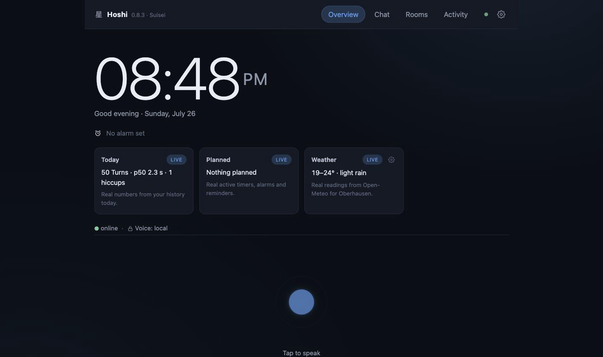
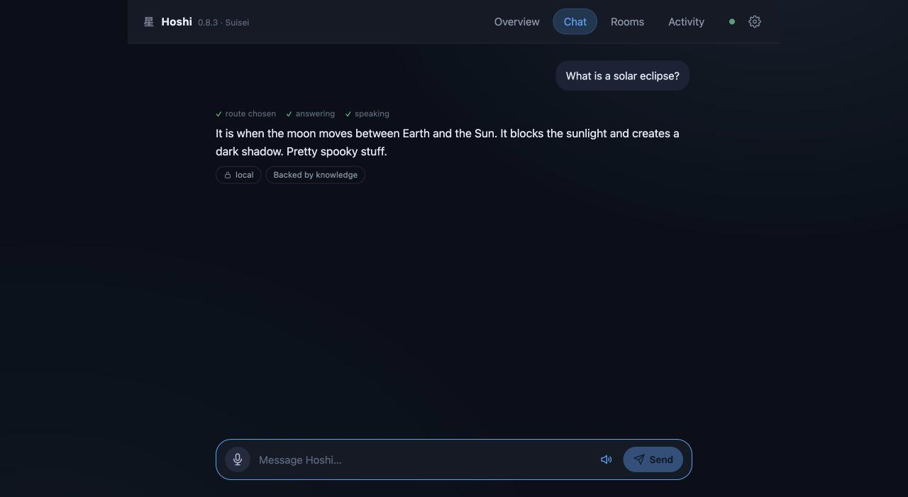

# Hoshi 星

**English (this page)** · **[Deutsch](README.de.md)**

<picture>
  <source media="(prefers-color-scheme: dark)" srcset="docs/assets/hero-dark.svg">
  
</picture>

> **A private, local-first voice assistant you can trust.**
> Runs on a single Apple Silicon Mac (16 GB). No cloud requirement, no project telemetry —
> your voice stays home.

<p align="center">
  
  
</p>

<p align="center">
  <sub>
    The ticks above each answer show what the turn <em>actually</em> did; the lock shows whether it stayed local.<br>
    Interface in five languages (EN/DE/ES/FR/IT) · <a href="README.de.md">Deutsche Kurzfassung</a>
  </sub>
</p>

**Status:** 0.9.x — under active development, heading toward 1.0. The exact version this tree
carries is the `version=` line in [`gradle.properties`](gradle.properties) (and the banner of
`bin/hoshi help`); the honest state of every release, known edges included, lives in
[`CHANGELOG.md`](CHANGELOG.md).

---

## What is Hoshi?

Hoshi is a voice assistant for one household, built on one principle: **everything that can
happen at home, happens at home.** Wake word on the satellite, speech recognition, the language
model, the knowledge base, the voice — all local. The internet is an explicit, consented
exception, never a dependency.

- **A full local voice turn.** On-device wake word (ESP32-S3) → Whisper STT → Gemma 4 brain
  (MLX on the Metal GPU) → streaming TTS — first audio from ~3 s.
- **Knowledge looks home first.** Questions ground against a local Wikipedia index in ~100 ms.
  If that doesn't cover it, Hoshi *says so* and offers to look it up online — and tells you
  afterwards where the answer came from: "had a quick look at what I've got here" vs.
  "checked online". A four-stage control (off / offline / ask first / automatic) puts you in
  charge, from the settings or by voice.
- **Two brains, chosen automatically.** Typing gets the thorough model (Gemma-4-12B — runs via
  a bundled MLX architecture patch), speaking gets the fast one; the swap hides inside your own
  speaking time. Optional, off by default. A persona-KV freeze now keeps the warm cache across
  repeated prompt prefixes — a measured ×27 faster warm time-to-first-token, with a coherence
  A/B tool standing by to keep checking that answer quality doesn't drift.
- **Reflexes without thinking pauses.** Timers, alarms, lights, color temperatures, and now the
  vacuum (start / return-to-base, with real state — "ready in the dock" instead of a ghostly
  "last seen…") all route through deterministic, brain-free fast paths — no LLM between
  "Licht an" and the light.
- **A hallway display you can actually rearrange.** Big clock (the moon phase joins it at night,
  computed locally), live weather with a rain answer ("6.1 mm today" / "dry"), a multi-source
  news teaser (public broadcasters, attributed, no brain calls behind it), real countdowns, the
  shopping list — and empty cards disappear instead of claiming "nothing planned". Tiles live on
  a free grid: drag one anywhere, resize it with +/− controls, and switch any widget on or off
  from Settings — the layout survives being turned off and on again.
- **Speaks five languages — and *understands* commands in German and English** (several fast
  paths already trigger in all five; the smart-home classifier does not yet). Roughly 770
  backend sentences, streamed phrase pools so replies don't repeat, honest provenance in every
  language. Time and date formats follow along.
- **Sixteen living scene themes,** in three time-of-day groups — morning, day, evening & night —
  from Asagiri (朝霧) through Aoi (青) to Nagareboshi (流れ星); an automatic theme (Sora) picks one
  for you by the clock, and a hidden mood theme (Nagori, three taps on the version line) rewards
  the curious. A one-click, full-screen gallery replaces the old cramped drawer, grouped by time
  of day and ordered by brightness. Driven by shared design tokens; `prefers-reduced-motion`
  respected.
- **A diary of measurements, never of content.** Timestamps, categories, latencies — no
  conversation content, ever. The activity tab shows p50/p95 per pipeline stage.

## What makes it different

1. **Honesty is architecture, not tone.** Unknowns produce a deterministic "I don't know"
   instead of hallucination; the UI shows "—" rather than invented numbers; a cached answer
   says it is one; an online answer carries its source. An execution-claim gate (the "Kagami"
   mirror) refuses to let a reply claim a switch that never happened; its first live replay ran
   green (13 corpus cases, 14 turns, zero false completion claims, zero proof gaps), and the
   satellite proved the same thing on real hardware — "kitchen switches kitchen", light on and
   back off, logged with `toolCallRan=true`. The house rule `green ≠ alive` (a green test is not
   yet a living feature) governs every acceptance.
2. **Trust lives in code, not in prompts.** A capability kernel with default-deny for every
   writing action; biometric voice profiles never leave the device; unknown voices are never
   auto-enrolled; the private knowledge library is `egress: never` by design.
3. **The model is a replaceable cell.** Hexagonal ports, model choice as a config line,
   measured A/B candidates, human-ear acceptance for voice swaps — built to get better with
   each model generation without losing its soul.
4. **The 16 GB wall as a design teacher.** One resident brain, admission control, honest
   memory-pressure display ("memory is tight — voice replies may feel sluggish") — frugality
   is a feature, not a compromise.
5. **Built by one human with an AI team.** That is how Hoshi came to be and how it keeps being
   built — with the human as the measure: blind-labeled test sets, taste gates, and the
   finding that ten minutes of real use beats four review agents. (Project foundations live
   LLM-readable in [`vault/`](vault/00-INDEX.md).)

## Known edges (honest)

- **Speaker recognition is switched off.** Enrollment (three sessions on three days, with a
  per-sample diagnosis) and profiles exist; recognition stays off until a sealed holdout
  proves the profiles actually separate. Unknown voices are never auto-enrolled.
- **ES/FR/IT are real translations but not native-reviewed**, and have no Piper voice yet
  (spoken by the macOS `say` sidecar).
- **Graceful shutdown** is configured but has never been proven against a live turn.
- The 12B brain **requires the bundled mlx-lm patch** — no released mlx-lm knows its
  architecture yet.
- Hoshi is hardened on **exactly one machine**; expect edges when adapting it. Making it
  genuinely installable for others is the current focus.
- A few pieces are deliberately parked for a later release: the official weather-warning feed
  (NINA) and news personalization, the calendar widget (waiting on a Home Assistant calendar
  integration), and the satellite side of multi-turn follow-up questions (the server half
  landed; the flag stays off until the firmware half exists).

## Architecture & quickstart

Hexagonal (ports & adapters): a thin Kotlin/Spring WebFlux backend orchestrates Python/MLX
sidecars and talks to satellites over an authenticated `/ws/audio` contract (ESPHome/HA Voice).

```bash
./gradlew build                          # backend (Kotlin modules + ArchUnit guards)
cd frontend && npm install && npm run build
bin/hoshi run      # boots locally on :8090
bin/hoshi doctor   # honest, read-only stack status (OK/DEGRADED/DOWN)
```

Requires an Apple Silicon Mac (MLX needs the Metal GPU); the Gradle wrapper auto-provisions
JDK 21. All sidecars live in [`sidecars/`](sidecars/) with pinned bootstrap paths; a fresh
install defaults to macOS `say` (no API key, no model download) — Piper remains an explicit
GPL/model opt-in. Large models and the Wikipedia database are external artifacts.
Full setup guide: [`SETUP.md`](SETUP.md) · German overview: [`README.de.md`](README.de.md).

## Built with Codex and GPT-5.6

Hoshi predates Build Week. Since then, **Codex with GPT-5.6** has worked as both an
implementation agent and an adversarial reviewer — it owns the local knowledge chain
end-to-end, contributed the speaker-recognition safety tooling, the Piper sidecar, themes,
and the private knowledge library groundwork. A separate orchestrator reviews, integrates and
independently re-measures every delivery — and has been corrected by Codex more than once,
including a withdrawn measurement claim. Andi remains responsible for product direction and
for every privacy, deployment and production gate.

The agents coordinate through **CollabOS**: a small, inspectable, file-based protocol — a
directory of letters. Every agent reads its inbox, writes its outbox, and all of it lands in
version history. No service, no daemon; just files you can still read later. Including the
mistakes.

## Stack
- **Backend:** Kotlin · Spring WebFlux · Java 21
- **Brain (LLM):** Gemma-4 via MLX (lokal) — 16-GB-Wand: ein Modell resident
- **STT:** Whisper-MLX · **TTS:** macOS `say` / Piper (lokal), OpenAI (Cloud), Voxtral (derzeit deaktiviert)
- **Speaker-ID:** CAM++ (Wespeaker, Apache-2.0) · **Wissen:** lokale Wiki-RAG
- **Frontend:** React · Vite · TypeScript · **Satellit:** ESPHome (HA Voice PE)

## Build & Run

**Voraussetzungen**
- Apple-Silicon-Mac (macOS). MLX braucht die Metal-GPU — läuft nicht in einem Linux-Container oder
  auf x86.
- **JDK 21 musst du nicht selbst installieren.** Der Gradle-Wrapper provisioniert es automatisch
  (foojay-resolver-convention in [`settings.gradle.kts`](settings.gradle.kts) +
  `org.gradle.java.installations.auto-download=true` in [`gradle.properties`](gradle.properties)).
  Verifiziert (2026-07-11) mit komplett frischem `GRADLE_USER_HOME` (kein JDK, keine
  Gradle-Distribution vorab gecacht): `./gradlew` lädt sich Gradle selbst *und* JDK 21 und baut grün —
  auch wenn die Maschine sonst nur ein neueres/anderes JDK auf dem PATH hat.
- Node 20+ fürs Frontend.

**Backend bauen**
```bash
./gradlew build
```
Baut alle Kotlin-Module (hexagonal: `core-domain`, `capability-kernel`, `adapters-*`, `web-inbound`)
inkl. Tests und den ArchUnit-Guards (der Kern darf nicht auf Spring/Adapter zeigen).

**Frontend bauen**
```bash
cd frontend && npm install && npm run build
```

**Python-Sidecars (STT/TTS/Brain/Speaker-ID/Knowledge) — ehrlicher Stand**
Hoshi orchestriert mehrere lokale Sidecars über HTTP auf festen Ports: Whisper-STT (`:9001`),
Speaker-ID/CAM++ (`:9002`), Knowledge-Bridge/Wiki-RAG (`:8035`), Brain/LLM via MLX (`:8041`)
und lokale TTS-Optionen (`say` `:8044`, Piper `:8045`; der alte Voxtral-Pfad wäre `:8042`).
OpenAI-TTS ist kein lokaler Sidecar. `bin/hoshi up` fährt den lokalen Stack brain-guard-sicher und
idempotent hoch (siehe `bin/hoshi help` bzw. [`pipeline/up.sh`](pipeline/up.sh)).

**Fresh-Clone-TTS:** Ohne gespeicherte Wahl und ohne `HOSHI_TTS` ist der eine
Default **`say`**. Er braucht keinen API-Key und kein Sprachmodell; einmalig werden
nur die gepinnten Python-Webserver-Abhängigkeiten eingerichtet:

```bash
sidecars/say/bootstrap.sh
bin/hoshi up
bin/hoshi voice
```

`bin/hoshi run` beweist bewusst nur App-Boot und Auth-Wand, nicht die Hörbarkeit.
`bin/hoshi voice` ist der echte Audio-Beweis und bricht mit einer konkreten
Bootstrap-/Sidecar-Meldung ab, statt einen stummen Turn als „läuft“ zu verkaufen.
Piper bleibt optional: `sidecars/piper/bootstrap.sh` lädt Runtime und Modelle erst
nach einer expliziten Entscheidung; anschließend kann `HOSHI_TTS=piper` bzw. die
Einstellung im UI gewählt werden.

**Brain, Whisper-STT, Speaker-ID und Knowledge-Bridge sind Teil dieses Repos** ([`sidecars/`](sidecars/)): je Sidecar
ein gepinntes `bootstrap.sh` (venv + requirements; externe Modelle/Daten bleiben ausserhalb) und ein
`run.sh`. `bin/hoshi up` wählt automatisch den Repo-Sidecar, sobald
sein venv gebootstrapped ist (Override: `HOSHI_SIDECARS_FROM_REPO=true|false`). `say` und Piper
liegen als lokale TTS-Engines im Repo; `say` ist der Fresh-Clone-Default, Piper
bleibt wegen Bootstrap/Modell/GPL explizit opt-in. Nur der deaktivierte Legacy-Voxtral-Pfad nutzt
noch Run-Skripte eines separaten, unveröffentlichten Vorgänger-Checkouts (`HOSHI_05_ROOT`);
auf einem frischen Klon wird ein fehlender Sidecar ehrlich übersprungen (Warnung statt Fake-Start).

**Backend starten**
```bash
bin/hoshi run      # bootet lokal auf :8090, prüft Health + die Auth-Wand (401 ohne Token)
bin/hoshi verify   # Gate: Deploy-Render + TTS-Fresh-HOME + Build/Tests + Live-Brain
bin/hoshi doctor   # ehrlicher, read-only Stack-Status (Brain/Sidecars/RAM — OK/DEGRADED/DOWN)
```

**Konfiguration / Env-Vars**
Laufzeit-Flags (Feature-Flags, Sidecar-URLs, Tokens) sind Spring-Properties, gesetzt über
`Environment=`-Zeilen. Die vollständige, kommentierte Referenz für einen Produktions-Deploy ist
[`tools/systemd/hoshi-0.8-backend.service`](tools/systemd/hoshi-0.8-backend.service) — dort stehen
alle bekannten Flags samt Begründung; echte Secrets/Tokens sind darin nur `__PLATZHALTER__`, die ein
Deploy-Skript füllt und nie committet. Für lokale Entwicklung reichen die Defaults; sensible Pfade
(Cloud-TTS, Sprecher-Erkennung, HA-Steuerung) sind einzeln flag-gated und default-dokumentiert in
derselben Datei.

**Ehrlichkeit zuerst:** Hoshi ist ein persönliches Projekt, gebaut und gehärtet auf genau einem
Apple-Silicon-Mac (16 GB) in einem spezifischen Zuhause-Setup (ein bestimmtes Home-Assistant/LAN).
Es ist kein für beliebige Umgebungen poliertes Produkt — Pfade, Ports und Annahmen spiegeln diese eine
Maschine. Wer es adaptiert, sollte Kanten erwarten (siehe Abschnitt oben zu den Sidecars).

## Die drei Repos · The three repositories

Hoshi ist eines von drei Stücken, die zusammengehören:

| | |
|---|---|
| **hoshi-0.8** *(hier)* | Der Assistent: Backend, Oberfläche, Sidecars, Wire-Protokolle · *The assistant itself* |
| [**hoshi-satellite**](https://github.com/AndiGermany/hoshi-satellite) | Die Hardware-Seite: eigene ESPHome-Firmware für den Sprach-Satelliten — LED-Ring als Sprache, Wake-Word on-device · *The hardware side* |
| [**collab-os**](https://github.com/AndiGermany/collab-os) | **Das Making-of:** wie eine Person mit KI-Agenten das hier gebaut hat — die Methode, die Messdisziplin und ein Log jeder Lehre, die zweimal gelernt werden musste · *How it was actually built, mistakes included* |

> Wenn dich weniger interessiert, *was* Hoshi kann, als *wie* so etwas entsteht:
> [collab-os](https://github.com/AndiGermany/collab-os) ist der ehrlichere Teil der Geschichte.
> Er enthält auch die Ideen, die gestorben sind — und warum.
>
> *If you care less about what Hoshi does and more about how something like this gets built,
> collab-os is the more honest half of the story. It includes the ideas that died, and why.*

## Mitmachen
Siehe [`CONTRIBUTING.md`](CONTRIBUTING.md) — inkl. Lizenz-Zustimmung und DCO (`Signed-off-by`). Die
Vision, die Invarianten und die Roadmap leben im Vault: [`vault/00-INDEX.md`](vault/00-INDEX.md).

## Danke — auf wessen Schultern Hoshi steht

Hoshi ist die Arbeit einer Person und einiger KI-Assistenten. Alles, was ihn hören,
denken und sprechen lässt, haben andere gebaut und verschenkt. Diese Liste ist
deshalb keine Compliance-Anlage, sondern ein Dankeschön — und sie ist ehrlich
dort, wo etwas *nicht* frei ist.

**Damit Hoshi denkt**
[Gemma 4](https://ai.google.dev/gemma) (Google) läuft als Sprachmodell lokal auf dem Mac —
über [MLX](https://github.com/ml-explore/mlx) und [mlx-lm](https://github.com/ml-explore/mlx-lm)
(beide MIT, Apple), die Inferenz auf Apple Silicon überhaupt erst praktikabel machen.
⚠️ Gemma steht **nicht** unter einer OSI-freien Lizenz, sondern unter Googles eigenen
[Gemma Terms of Use](https://ai.google.dev/gemma/terms) samt Prohibited-Use-Policy. Dasselbe
gilt für **EmbeddingGemma**, das über [Ollama](https://github.com/ollama/ollama) (MIT) das
episodische Gedächtnis trägt. Hoshis *Code* ist Apache-2.0 — sein *Modell* ist es nicht, und
das soll hier nicht untergehen.

**Damit Hoshi hört**
[Whisper large-v3-turbo](https://github.com/openai/whisper) (OpenAI) erkennt Sprache, portiert
über [mlx-whisper](https://github.com/ml-explore/mlx-examples) (MIT, Apple). Ehrlicher Hinweis:
das Ursprungsmodell steht unter MIT, die von uns genutzte mlx-community-Konvertierung trägt
**kein eigenes Lizenz-Tag** — in [`models.json`](models.json) daher als `UNVERIFIED` geführt
statt als MIT behauptet.
Wer gerade spricht, erkennt [CAM++](https://huggingface.co/Wespeaker/wespeaker-voxceleb-campplus)
aus dem **Wespeaker**-Projekt (Apache-2.0), gerechnet von
[ONNX Runtime](https://github.com/microsoft/onnxruntime) (MIT) und
[kaldi-native-fbank](https://github.com/csukuangfj/kaldi-native-fbank) (Apache-2.0).

**Damit Hoshi spricht**
[Piper](https://github.com/OHF-Voice/piper1-gpl) ist die vollständig lokale TTS-Engine — die
deutsche Stimme stammt von [Thorsten-Voice](https://huggingface.co/Thorsten-Voice/Piper)
(Modell MIT, Datensatz CC0), die englische aus
[rhasspy/piper-voices](https://huggingface.co/rhasspy/piper-voices) (LibriVox, public domain).
⚠️ Piper ist **GPL-3.0-or-later** und damit Copyleft; es bleibt deshalb bewusst optional und
opt-in — Details und Begründung in [`sidecars/piper/LICENSES.md`](sidecars/piper/LICENSES.md).
Besonderer Dank an **Thorsten Müller**, der seine Stimme unter CC0 verschenkt hat: ohne solche
Menschen gäbe es keine gute deutsche Sprachausgabe abseits der großen Anbieter.

**Damit Hoshi etwas weiß**
Der lokale Wissensspeicher ist die **deutschsprachige Wikipedia** (CC BY-SA) — zehntausende
Freiwillige, deren Arbeit hier offline durchsuchbar ist. Die Attribution ist im Wissens-Sidecar
als Quellen-/Lizenzmetadaten fest verdrahtet, nicht nachträglich angeklebt. Ob diese
Metadaten in Voice und UI für eine öffentliche Weitergabe ausreichend präsentiert
werden, bleibt trotzdem ein menschliches Release- und Lizenz-Gate. Die große
Datenbank bleibt ein externes Artefakt.
[`tools/knowledge-pack`](tools/knowledge-pack/README.md) baut kleine, immutable Release-Packs direkt
aus einem kryptografisch gebundenen Wikimedia-Dump; der historische DB-Export bleibt ehrlich als
nicht veröffentlichbarer Forensikpfad markiert. Ob ein Pack tatsächlich besser trifft,
entscheidet der getrennte [`tools/knowledge-bench`](tools/knowledge-bench/README.md), nicht seine
Größe oder sein Build-Erfolg.

**Damit Hoshi das Zuhause erreicht**
[Home Assistant](https://github.com/home-assistant/core) (Apache-2.0) ist die Brücke zu Licht,
Heizung und Geräten. Der Satellit läuft auf einer eigenen
[ESPHome](https://github.com/esphome/esphome)-Komponente (Python MIT, Runtime-Anteile GPLv3) —
inklusive des Wake-Words, das on-device und ohne Cloud erkennt.

**Das Fundament**
[Kotlin](https://github.com/JetBrains/kotlin), [Spring Boot & WebFlux](https://github.com/spring-projects/spring-boot),
[Project Reactor](https://github.com/reactor/reactor-core), [Jackson](https://github.com/FasterXML/jackson-databind),
[SQLite (sqlite-jdbc)](https://github.com/xerial/sqlite-jdbc) und
[ArchUnit](https://github.com/TNG/ArchUnit) (alle Apache-2.0), dazu
[SLF4J](https://github.com/qos-ch/slf4j) (MIT) und [Logback](https://github.com/qos-ch/logback)
(EPL-2.0/LGPL-2.1). Im Frontend [React](https://github.com/facebook/react),
[Vite](https://github.com/vitejs/vite) und [Vitest](https://github.com/vitest-dev/vitest) (MIT)
sowie [TypeScript](https://github.com/microsoft/TypeScript) (Apache-2.0). Gebaut mit
[Gradle](https://github.com/gradle/gradle) (Apache-2.0), getestet mit
[JUnit 5](https://github.com/junit-team/junit5) (EPL-2.0, nur im Test-Pfad).

> Sollte hier eine Lizenz falsch oder ein Projekt zu Unrecht ungenannt sein: bitte melden.
> Das wäre ein Fehler, den wir korrigieren wollen — kein Kleingedrucktes.

## Lizenz
Der eigene Hoshi-Code steht unter der [Apache License 2.0](LICENSE) — siehe auch [`NOTICE`](NOTICE).
Optional heruntergeladene Runtimes, Modelle und Daten behalten ihre jeweiligen Lizenzen; besonders
Piper ist GPL-3.0-or-later und wird nicht als Apache-Artefakt ausgegeben (siehe
[`sidecars/piper/LICENSES.md`](sidecars/piper/LICENSES.md)). Beiträge laufen über den DCO, siehe
[`CONTRIBUTING.md`](CONTRIBUTING.md#lizenz--herkunft-dco).

---

*Ad astra per aspera — Hoshi (星), der Stern, der bleibt. Jede Mitwirkung ist eine Sternschnuppe über seinem Himmel.*

*Ad astra per aspera — Hoshi (星), the star that stays. Every contribution is a shooting star across its sky.*
